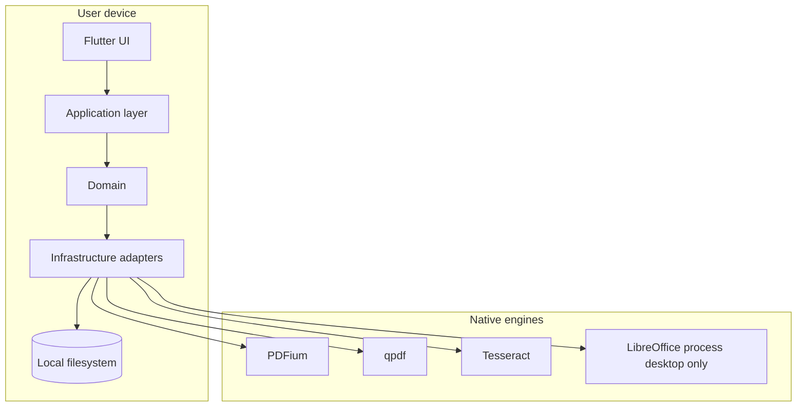

# Architecture — Document Studio

Overview of system structure. Details: [MASTER-SPECIFICATION.md](MASTER-SPECIFICATION.md) section 10, [FLUTTER-ARCHITECTURE.md](FLUTTER-ARCHITECTURE.md), [PDF-ENGINE.md](PDF-ENGINE.md).

## System context

No Document Studio server. Optional user-initiated network only for future language pack downloads (policy in [PRIVACY.md](PRIVACY.md)).

## Layers

| Layer | Responsibility | Must not |
| --- | --- | --- |
| Presentation | Widgets, routes, themes | Call FFI |
| Application | Commands, JobRunner, tool registry | Parse PDF syntax |
| Domain | Models, errors, tool definitions | Know platform APIs |
| Infrastructure | Engine adapters, temp files | Contain layout-only UI state |
| Platform | Intents, entitlements, scan UI | Duplicate business rules |

## Core patterns

### Tool registry

Every user-facing operation registers metadata and a runner. Batch and workflows reuse the same IDs.

### Job pipeline

Validate → temp workspace → engine → validate output → atomic publish → cleanup.

### Document session

One `PdfDocumentSession` per open file in viewer/editor; separate short-lived handles for batch jobs.

## Engine split (PDF)

| Concern | Engine |
| --- | --- |
| Render, text, search, light create | PDFium |
| Merge, split, encrypt, compress streams, repair | qpdf |

See [PDF-ENGINE.md](PDF-ENGINE.md).

## Cross-cutting

- **Errors:** domain `DocumentStudioException` + code enum → localized UI string ([MASTER-SPECIFICATION.md](MASTER-SPECIFICATION.md) §24).
- **Concurrency:** isolates / native workers; UI thread never blocked on OCR or large merge.
- **Platform matrix:** tool registry flags hide unsupported tools (e.g. Office on mobile).

## Related ADRs

[DECISIONS.md](DECISIONS.md) ADR-001 through ADR-010.
