# Feature Dependency Graph — Document Studio

Dependencies are **logical** (must exist before or during). Arrows read as “depends on”.

## Foundation stack

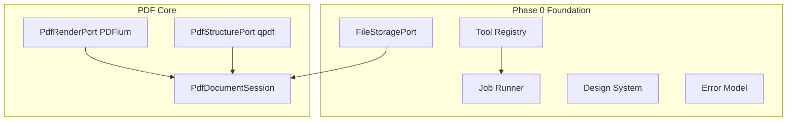

## Viewer chain

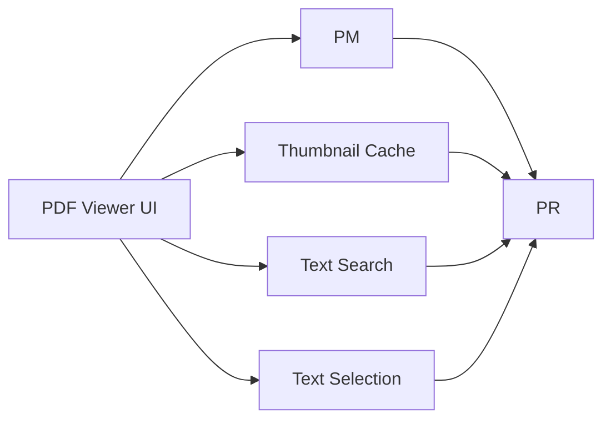

## Organization chain

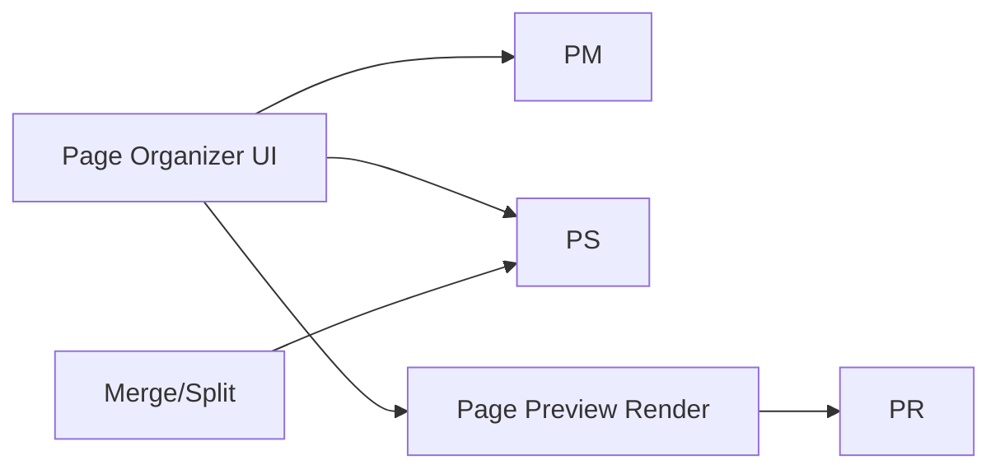

## Creation chain

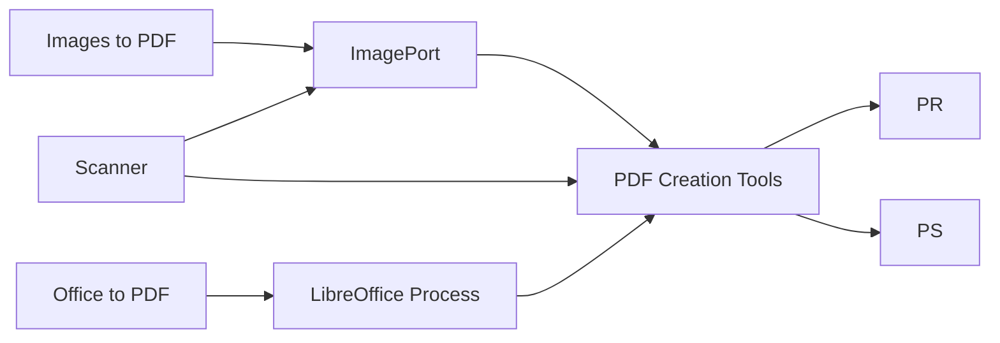

## Edit & annotation chain

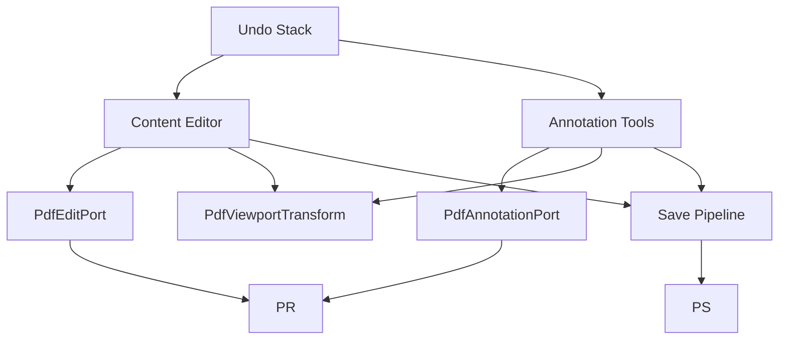

## OCR chain

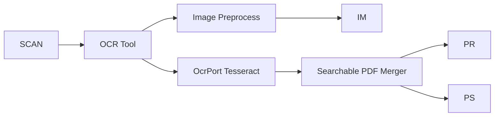

## Security chain

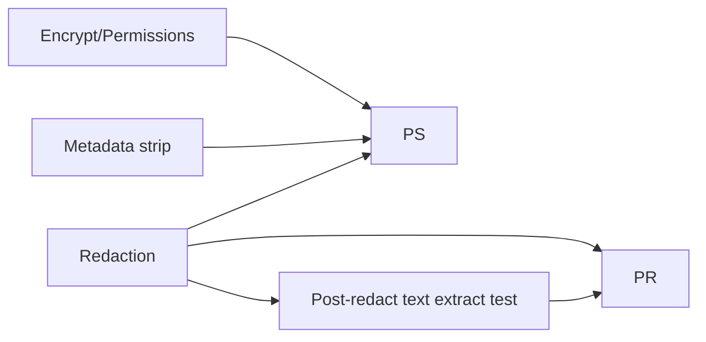

## Forms & signatures

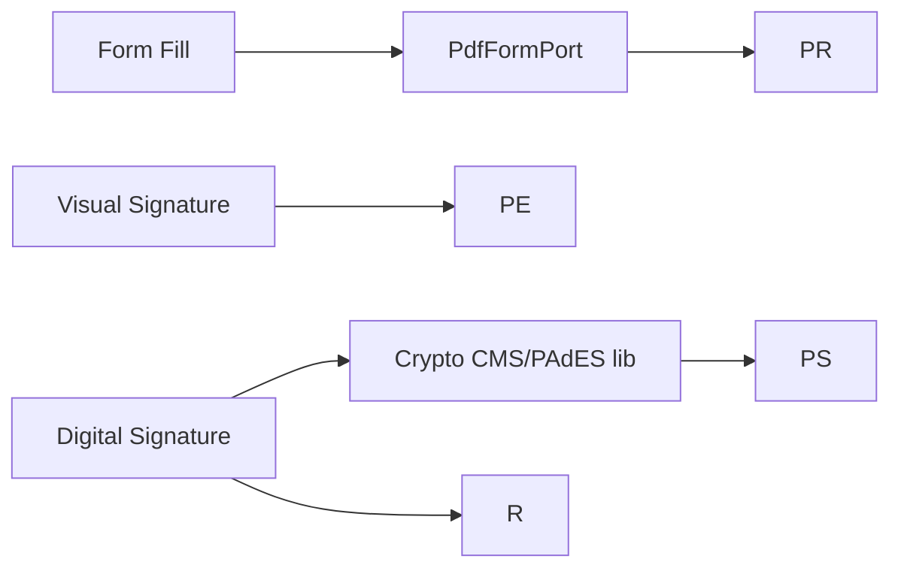

## Conversion chain

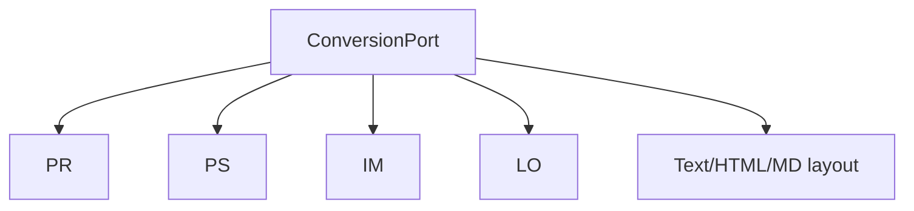

## Advanced

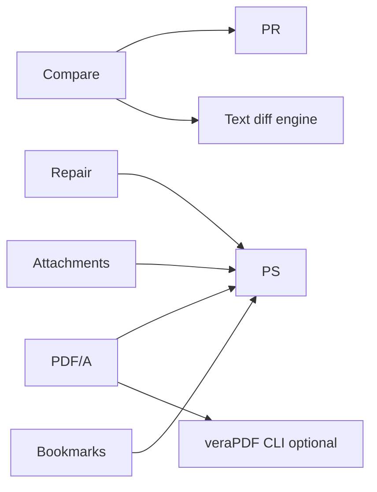

## Batch & workflow

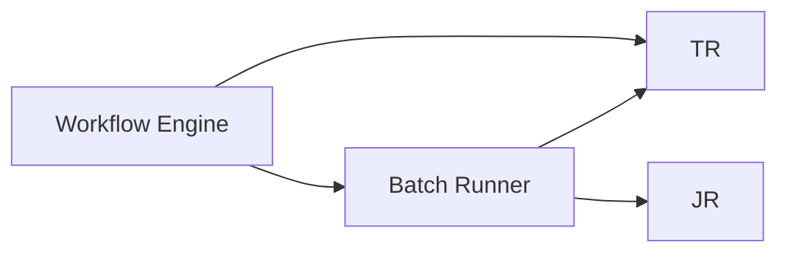

## Cross-cutting dependencies

| Feature area | Hard depends on |
| --- | --- |
| All tools | FileStoragePort, Error model, JobRunner |
| Any PDF write | PdfStructurePort or PdfRenderPort save path |
| Desktop Office | LibreOffice detect + subprocess sandbox |
| Searchable OCR | PdfRenderPort + OcrPort + merge |
| Compare side-by-side | Two PdfDocumentSession + sync controller |
| Workflows | Stable tool IDs + serial temp dir |
| Accessibility check | Text extract + structure introspection (limited) |

## Parallel tracks (can develop concurrently after Phase 0)

- **Track A:** Viewer + File shell (Phase 1)
- **Track B:** qpdf plugin (Phase 2)
- **Track C:** Image + create PDF (Phase 3)
- **Track D:** OCR plugin (Phase 6)

Editing (Phase 5) must not start before Viewer transform + annotation port design (Phase 4 partial).

## Versioning

When a port API changes, update this graph and ADR in [DECISIONS.md](DECISIONS.md).
