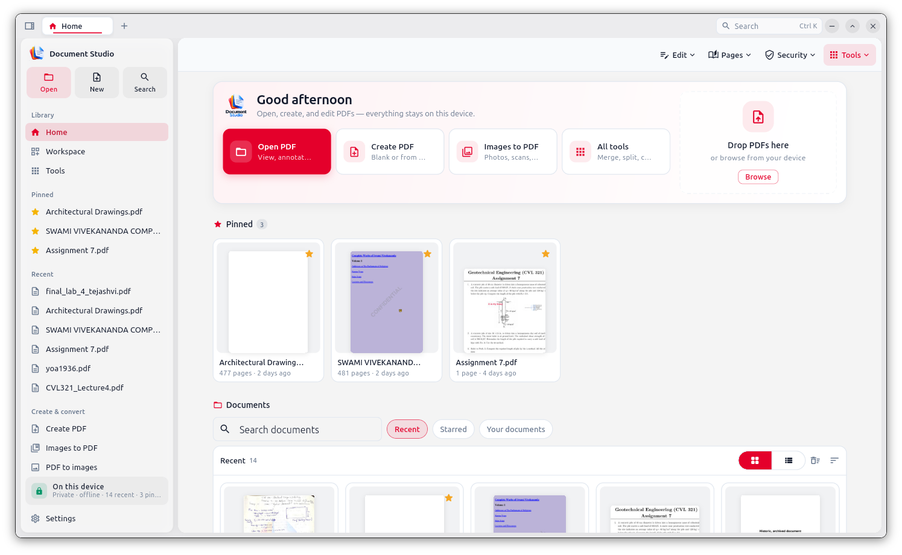

# Overview

**Document Studio** is a free, ad-free application for working with PDFs, images, and common document formats — **entirely on your device**.

Created by **[Tejashvi Kumawat](https://tejashvi-kumawat.github.io)**.

## Why it exists

Most “PDF tools” push you into a browser upload. Document Studio is the opposite:

- No account  
- No cloud conversion of your files  
- No ads  
- Desktop builds show up as a real app (Start Menu / Applications / Linux app search)

## What you can do

| Category | Tools |
| --- | --- |
| **Home** | Open, create, images↔PDF, pinned/recent, tools hub |
| **Organize** | Merge, split, extract, insert, reorder, rotate, crop, resize |
| **Optimize** | Compress, watermark, batch, metadata, repair |
| **Protect** | Encrypt, decrypt, headers/footers, page numbers, redact |
| **Sign** | Visual signatures, stamps, certificate / digital sign, fill forms |
| **Edit** | Text edit, highlight, shapes, comments, links, compare |
| **Capture** | Insert scan, OCR / searchable PDF |
| **Convert** | Office → PDF (desktop), create from text |

## Current release

**v1.0.3** — [GitHub Releases](https://github.com/tejashvi-kumawat/DocumentStudio/releases/tag/v1.0.3)

| File | Platform |
| --- | --- |
| `DocumentStudio-1.0.3-Setup.exe` | Windows |
| `DocumentStudio-1.0.3-macos.dmg` | macOS |
| `document-studio_1.0.3_amd64.deb` | Linux |

Next: [Download & install](#/install) · [How to use tools](#/how-to) · [Feature list](#/features).

## Project links

- Repository: [github.com/tejashvi-kumawat/DocumentStudio](https://github.com/tejashvi-kumawat/DocumentStudio)
- Author: [github.com/tejashvi-kumawat](https://github.com/tejashvi-kumawat)
- Portfolio: [tejashvi-kumawat.github.io](https://tejashvi-kumawat.github.io)
- Homebrew tap: [tejashvi-kumawat/homebrew-tap](https://github.com/tejashvi-kumawat/homebrew-tap)
